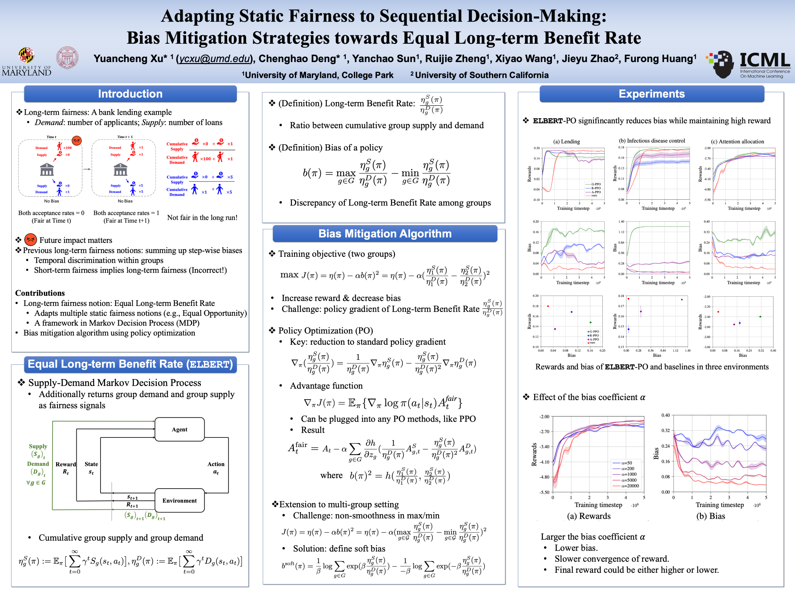

<p align="center">

  <h1 align="center">Adapting Static Fairness to Sequential Decision-Making: Bias Mitigation Strategies towards Equal Long-term Benefit Rate</h1>
  <h3 align="center"><a href="https://openreview.net/forum?id=yUPBkPKzHw">ICML 2024</a></h3>
  
  <p align="center">
    <a href="https://yuancheng-xu.github.io"><strong>Yuancheng Xu*</strong></a>
    ·
    <a href="https://github.com/dengch16"><strong>Chenghao Deng*</strong></a>
    ·
    <a href="https://ycsun2017.github.io"><strong>Yanchao Sun</strong></a>
    ·
    <a href="https://ruijiezheng.com"><strong>Ruijie Zheng</strong></a>
    ·
    <a href="https://si0wang.github.io"><strong>Xiyao Wang</strong></a>
    ·
    <a href="https://jyzhao.net"><strong>Jieyu Zhao</strong></a>
    ·
    <a href="https://furong-huang.com"><strong>Furong Huang</strong></a>
  </p>

</p>

<h3 align="center">
  <a href="https://arxiv.org/abs/2309.03426"><strong>[Paper]</strong></a>
  ·
   <a href="https://elbert-long-term-fairness.github.io/home/"><strong>[Project page]</strong></a>
  ·
  <a href="https://x.com/furongh/status/1714907795684741446"><strong>[X (Twitter)]</strong></a>

</h3>

<div align="center">
  
</div>

The codebase for the paper "Equal Long-term Benefit Rate: Adapting Static Fairness Notions to Sequential Decision Making" (https://arxiv.org/abs/2309.03426) by Yuancheng Xu*, Chenghao Deng*, Yanchao Sun, Ruijie Zheng, Xiyao Wang, Jieyu Zhao, Furong Huang.

The implementation of ELBERT Policy Optimization (ELBERT-PO) is provided.

## Environment set-up
First, install [Anaconda](https://docs.anaconda.com/anaconda/install/) to set up virtual environment. Then, run:
```
conda env create -f elbert.yaml
conda activate elbert
pip install -r requirements.txt
```

## Running ELBERT and other baselines 
The *.scripts/* folder includes bash scripts for ELBERT and other baselines (G-PPO, R-PPO, A-PPO) in five enviroments:
### Lending
* ELBERT
```
bash scripts/lending_elbert.sh
```
* Baseline (G-PPO, R-PPO, A-PPO)
```
bash scripts/lending_original.sh
```
### Infectious control, orginal version
* ELBERT
```
bash scripts/infectious_original_env_elbert.sh
```
* Baseline (G-PPO, R-PPO, A-PPO)
```
bash scripts/infectious_original_env_original.sh
```
### Infectious control, harder version
* ELBERT
```
bash scripts/infectious_harder_env_elbert.sh
```
* Baseline (G-PPO, R-PPO, A-PPO)
```
bash scripts/infectious_harder_env_original.sh
```
### Attention allocation, orginal version
* ELBERT
```
bash scripts/attention_original_env_elbert.sh
```
* Baseline (G-PPO, R-PPO, A-PPO)
```
bash scripts/attention_original_env_original.sh
```
### Attention allocation, harder version
* ELBERT
```
bash scripts/attention_harder_env_elbert.sh
```
* Baseline (G-PPO, R-PPO, A-PPO)
```
bash scripts/attention_harder_env_original.sh
```


## Comments
Our codebase is based on the following repo:
* [Policy Optimization with Constraint Advantage Regularization](https://github.com/ericyangyu/pocar)
* [Google ML-fairness-gym](https://github.com/google/ml-fairness-gym)

Thanks for their efforts to make the code public!
